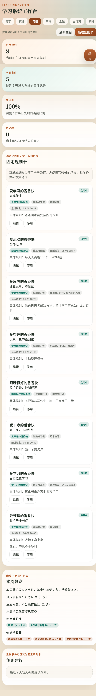
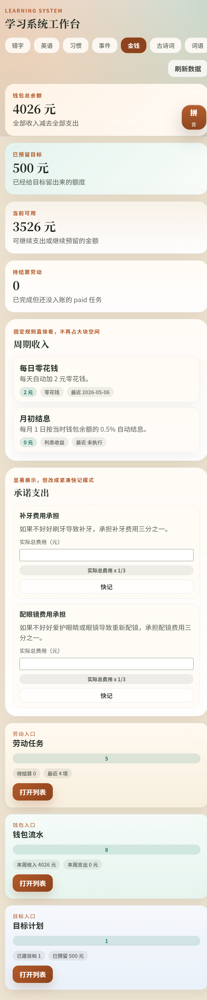

# 学习系统便携版

面向家庭学习场景的本地便携学习系统，覆盖错字、英语、事件与习惯、理财四组能力。

[下载 ZIP](./learning-system-portable.zip) | [校验文件](./learning-system-portable.zip.sha256) | [查看版本信息](#当前版本信息)

## 适合谁使用

- 希望把家庭日常学习和复盘放到同一套本地系统里管理。
- 希望下载后直接启动，不额外安装 Node.js 或执行命令。
- 希望把学习数据跟着目录整体迁移和备份。

## 这套系统能做什么

### 错字

- 录入错字，安排今日学习与待复习。
- 支持听写、抽查和高频错字优先处理。

### 英语

- 管理学习包，安排今日学习与复习。
- 支持学习模式、测验模式和连续会话练习。

### 事件与习惯

- 先记录教育事件，再沉淀长期规则。
- 结合最近趋势做习惯复盘和规则维护。

### 理财

- 记录劳动、收支、目标与周期收入。
- 查看余额、预留金额和近期流水变化。

## 快速开始

1. 下载 [learning-system-portable.zip](./learning-system-portable.zip) 并解压到固定目录。
2. 双击目录中的 `start.cmd`。
3. 浏览器会自动打开；如果没有自动打开，访问 `http://127.0.0.1:3000`。
4. 首次进入时输入默认访问密码：`123456Abc.`。

## 近期变更

- 2026-05-06：发布 README 改为正式首页模板，补齐快速开始、模块介绍、安装升级与常见问题。
- 2026-05-06：发布流程开始同步 README 配图目录，后续发布可以直接复用固定截图路径。
- 2026-05-06：当前对外介绍聚焦错字、英语、事件与习惯、理财四组能力。

## 安装与升级

- 电脑不需要预装 Node.js。
- 第一次启动如果弹出防火墙提示，允许本地访问即可。
- 升级新版本时，不要直接覆盖旧目录；解压到新目录后，把旧版本整个 `data/` 目录复制过去。
- 如果要迁移到另一台电脑，优先复制整个发布目录，尤其不要漏掉 `data/`。

## 下载校验

- 校验文件是 [learning-system-portable.zip.sha256](./learning-system-portable.zip.sha256)。
- 它用于确认 ZIP 下载完整，没有被截断或损坏。
- 如果你不做校验，至少保留这个文件，后续排查时可以直接核对。

## 常见问题

### 双击后没反应

- 确认压缩包已经完整解压。
- 确认 `runtime/node.exe` 仍然存在。
- 可以尝试右键 `start.cmd` 后重新运行。

### 浏览器没有自动打开

- 手动访问 `http://127.0.0.1:3000`。
- 启动后的黑色窗口不要关闭，关闭后页面会停止服务。

### 页面打不开或提示连接失败

- 先确认黑色窗口仍在运行。
- 如果安全软件拦截本地服务，请允许 `runtime/node.exe` 运行。

### 如何升级并保留数据

- 关闭旧版本。
- 解压新版本到新目录。
- 把旧版本整个 `data/` 目录复制到新目录。

## 当前版本信息

- Published at: 2026-05-06T21:18:12+08:00
- ZIP file: [learning-system-portable.zip](./learning-system-portable.zip)
- Checksum file: [learning-system-portable.zip.sha256](./learning-system-portable.zip.sha256)
- SHA256: 4B9D47289E10C06BE31D4A7C0FC336441D2AB76D89713555DA29752E6C606694
- Local source branch: main
- Local source tree state: dirty

